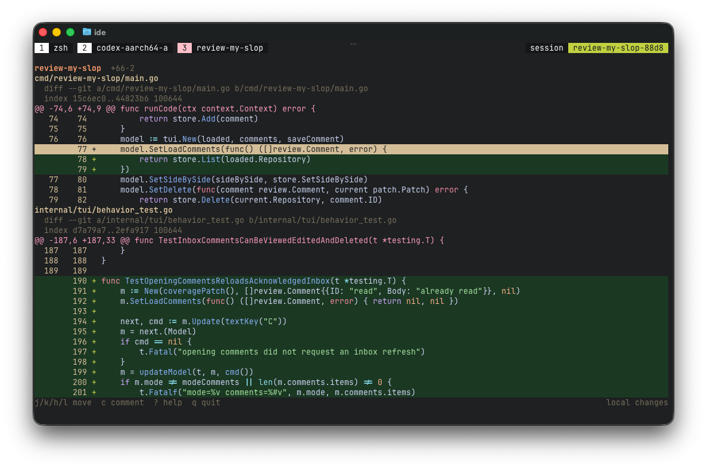

# review-my-slop



Coding has moved from the editor to the chat window. Agents can produce code at
a pace that makes reading the code a bottleneck.

However, without supervision, agents tend to slowly accumulate technical debt.
That debt increases the likelihood of mistakes, which in turn create more debt
and hidden bugs. By the time an agent burns through tokens on simple changes, it
is usually too late to correct course.

This is not simply an agent problem. Successful collaboration between the
developer and the agent requires a shared understanding of the codebase. The
mission of `review-my-slop` is to keep developers in the loop throughout their
coding projects, from start to finish.

`review-my-slop` is a keyboard-driven terminal diff viewer for reviewing local
changes, attaching comments to exact lines or ranges, and handing that feedback
back to the agent with one command.

## The workflow

1. Prompt the agent to make the initial change.
2. Review that slop by running `review-my-slop code` in the repository.
3. Read the diff and attach comments to individual lines or ranges.
4. Let the agent review your slop comments by asking it to run
   `review-my-slop comments` and act on them.
5. Repeat from step 2 until the code is no longer slop.

The review UI uses Vim-like key bindings for navigation, selection, search, and
comments. Press `?` at any time to see the complete key map.

All data stays truly local, and no telemetry is sent.

The implementation keeps domain changes in `internal/diff`, Git access in
`internal/git`, terminal interaction in `internal/ui`, comment delivery in
`internal/comments`, and editor drafts in `internal/editor`. Pending feedback
is stored in the fresh XDG data file `review-my-slop/inbox-v2.db`; it is not
read from or migrated from the older inbox format.

## Install

```sh
brew install EskelinenAntti/cli/review-my-slop
```

The project is licensed under the [MIT License](LICENSE).
